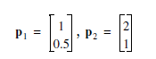

# Task
>Consider the following prototype patterns.
>
 
  
>Find weights and bias which will produce the decision boundary you
>found in part i, and sketch the network diagram.

(NNDesign 2nd Edition : E3.2 ii.)
